# image-autoencoding

In this task we consider Variational Autoencoder (VAE) in order to reconstruct and generate images for two datasets:
* [MS COCO](https://cocodataset.org/#download) [1]
* [Food-101](https://www.kaggle.com/dansbecker/food-101) [2]

## Project structure

* **configs:** all config files
* **data:** data loader
* **models:** vae architecture: encoder + decoder + re-parametrization layer

## Configs

* ```data_config.py:```   paths to datasets
* ```models_config.py:``` parameters for models
* ```train_config.py:```  training parameters

## Data setup

* Specify data directories in ```configs/data_config.py```

* Use settings either for MS COCO dataset or Food-101

* Data should have the same data root: 
```python
# root where datasets are located (might be home directory)
data_root = 'datasets/'
```

### MS COCO

* [Training set](http://images.cocodataset.org/zips/train2017.zip) 

* [Testing set](http://images.cocodataset.org/zips/test2015.zip) 

* [Validation set](http://images.cocodataset.org/zips/test2014.zip)

Example directory: ```datasets/coco/coco_train2017/train2017/```

```python
# COCO dataset
dataset = 'coco'
coco_train_data = 'coco_train2017/train2017'
coco_valid_data = 'coco_valid2017/val2017'
coco_test_data = 'coco_test2017/test2017'
```

We use training and testing data to train the network. It is allowed since VAE is trained in an unsupervised manner. The evaluation is done with the validation set.

### Food-101

* [Food-101](https://www.kaggle.com/dansbecker/food-101/download)

Example directory: ```datasets/food-101/images```

```python
# FOOD-101 dataset
dataset = 'food-101'
images_data = 'images'
meta_data = 'meta'
```


## Training

1. Set python path
```
export PYTHONPATH=$PYTHONPATH:[absolute path to the folder]/image-autoencoding/
```
2. Specify path to save the results in ```data_congifs.py```:

```# path where save the results
save_training_results = 'results/'
```

3. Specify training parameters in ```train_config.py```, e.g.

  ```python
  batch_size = 64
  learning_rate = 0.001
  weight_decay = 1e-7
  n_epochs = 100
  ```

4. Start training ```vae_train.py```

```
python3 vae_train.py  -o [user path] -l [path to logs]
```
  Flags:
  * ``` -o [user_path]``` user path to save the results
  * ``` -l [path to logs]``` path to save logs

5. The results will be saved in the folder: ```../[save_training_results]/vae/``` 


## Solution description

* Variational autoencoder (VAE) [3] is a generative model widely used in image reconstruction and generation tasks.
  It provides a more efficient way (e.g. in comparison to a standard autoencoder, PCA) to solve the dimensionality reduction problem for high dimensional data (e.g. text, images).
  
* A disadvantage of a simple autoencoder is its discrete latent space. As a result, there are some points which the autoencoder can not reconstruct. 
  VAE allows overcoming this problem. 
  
* VAE provides a continuous latent space due to KL divergence, which matches a prior normal distribution and a predicted encoder distribution (an approximate posterior). 

  A general VAE architecture is illustrated in Figure:
  
<p align="center">
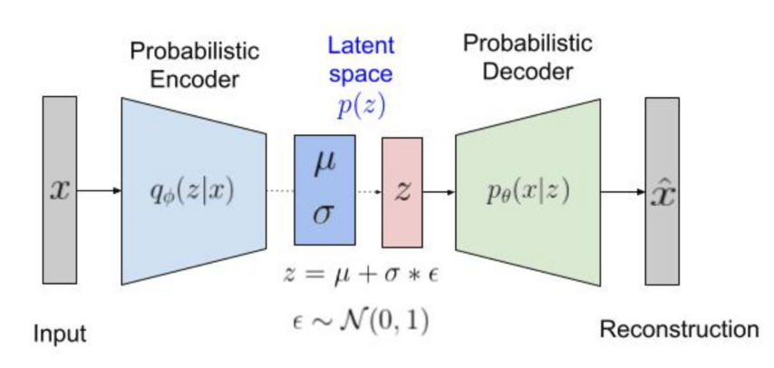
</p>

* It consists of an encoder (or a recognition model) and a decoder (or a generative model). The encoder outputs construct a Gaussian distribution with the mean  and the standard deviation .

* We use VAE with the  following decoder and encoder: 
    
   

* Image preprocessing is done in dataloader:
    - Image size = 64;
    - Center crop = 375;
    - Random Horizontal Flip;
    - Transform grey scale images to RGB image by channel replication;
    - Normalization (standardization) with mean=[0.5,0.5,0.5] and std=[0.5,0.5,0.5] 
      since we use Tanh output activation function in the decoder.
     
    
* Latent dimension = 128
* Batch size = 64 (512 for the latent space visualization)

### Re-parametrization trick

An optimization process requires a deterministic model rather than stochastic w.r.t. learnable parameters. Therefore, we have to re-parametrize the encoder outputs. Re-parametrization trick reads: , where 

*  and  are encoder outputs, 
*  is the random variable. 

The encoder returns  for numerical stability. We do the following for the re-parametrization:

```python
   def reparametrize(self, mu, logvar):

    """ Re-parametrization trick"""

    logvar = logvar.mul(0.5).exp_()
    eps = Variable(logvar.data.new(logvar.size()).normal_())

    return eps.mul(logvar).add_(mu)
```

  
### Loss function

- A VAE loss function represents the sum of a reconstruction error and KL divergence.

- Generally the reconstruction error corresponds to the mean square error between a ground thruth image and a reconstructed image 
  (here it is just a square error):
  
```python
# reconstruction error
mse = 0.5 * (x.view(len(x), -1) - x_tilde.view(len(x_tilde), -1)) ** 2
```
- KL divergence is calculated for the Gaussian encoder distribution:
```
# kl divergence
kld = -0.5 * torch.sum(-variances.exp() - torch.pow(mus, 2) + variances + 1, 1)
```

- Since we use separate optimizers for the encoder and the decoder networks we calculate the following loss function:

```python
if args.mode == 'vae':
        loss_encoder = (1 / batch_size) * torch.sum(kld)
        # loss_encoder = torch.sum(kld) 
        loss_decoder = torch.sum(recon_mse)
```
- Encoder loss corresponds to the penalizer term, which pushes the approximate posterior
to the prior.
- Decoder loss corresponds to the reconstruction error. 
- We use KL-divergence weighted with batch_size or not in order to achieve a trade-off between two terms.
- We minimize the sum instead of mean values.


### Metrics

There is a huge issue in the existing literature regarding the evaluation of generative models. We evaluated the reconstruction ability with 
the common image similarity metrics:

* Pearson Correlation Coefficient (PCC)
* Structural Similarity (SSIM)

However, they are not capable to capture human perception.

### Latent space

We visualized latent space only for training with *Food-101* dataset. To do this we transform labels to numbers in the dataloader:
```python
from sklearn import preprocessing

 # Transform labels to numbers
le = preprocessing.LabelEncoder()
le.fit(self.labels)
self.labels = le.transform(self.labels)
```
Then we use *scatter plot* during training (for training and validation sets):
```python
# Visualize latent space for training set
plt.figure(figsize=(10, 6))
plt.scatter(mus.cpu().detach()[..., 0], mus.cpu().detach()[..., 1], c=labels, cmap='rainbow')
plt.colorbar()
```

## Results 

### MS COCO

#### Ground truth images

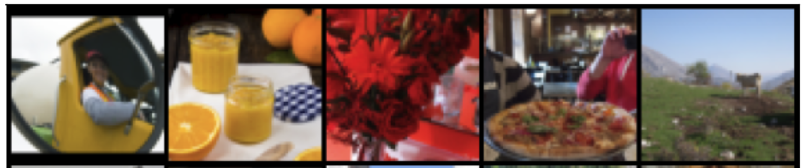

#### **3 training epochs:**

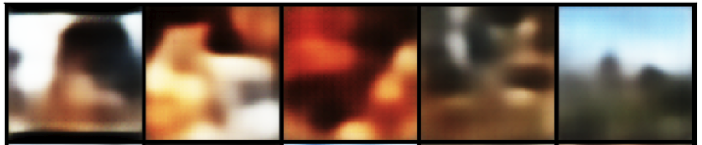


Reconstruction from sampled latent representations: 


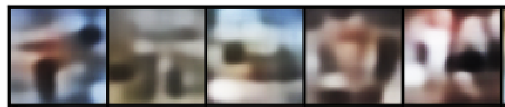


#### **20 training epochs:**


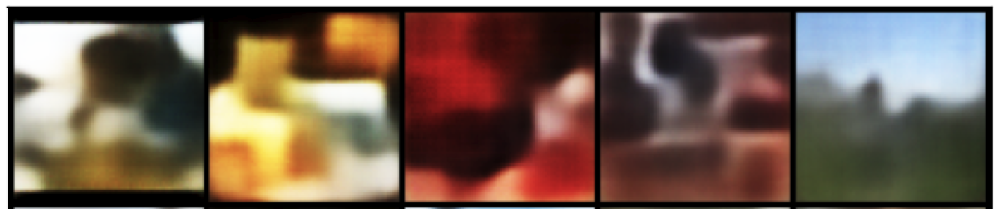

Reconstruction from sampled latent representations: 

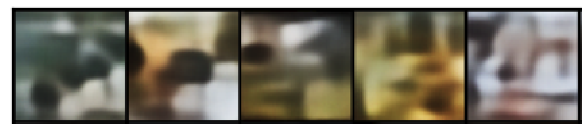

Since we use natural scenes, which are the most difficult for unsupervised training, the images generated 
from the random samples in the latent space are less meaningful in comparison to the models trained with other 
more structural and uniform datasets, e.g. widely used in related works CelebA dataset with faces, LSUN bedrooms etc. 


### FOOD-101

Let's try more uniform but smaller dataset FOOD-101. We also apply weight for KL divergence term.

#### Ground truth images

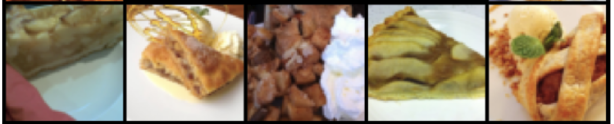

#### **3 training epochs:**

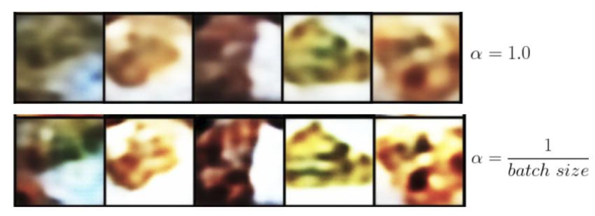

Reconstruction from sampled latent representations: 


Latent space for the test set (alpha=1):


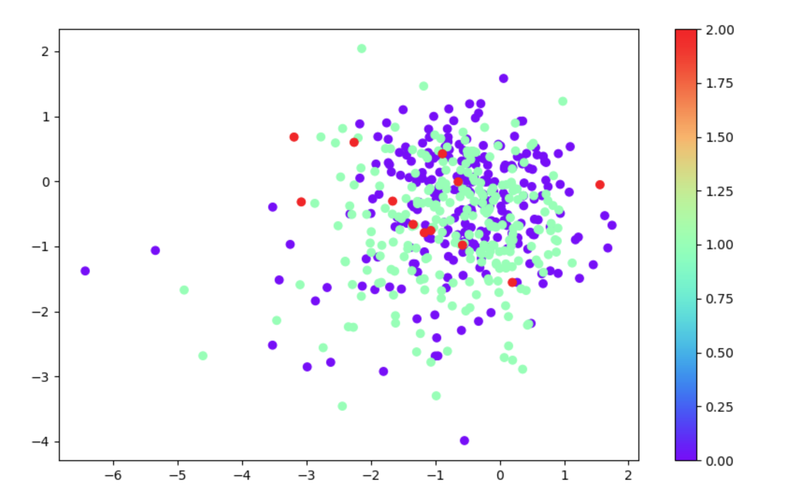


#### **10 training epochs:**

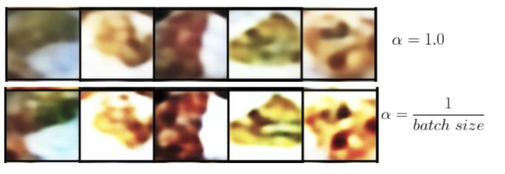


Reconstruction from sampled latent representations: 

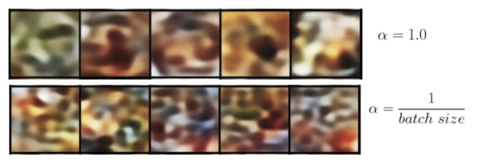


Latent space for the test set (alpha=1):

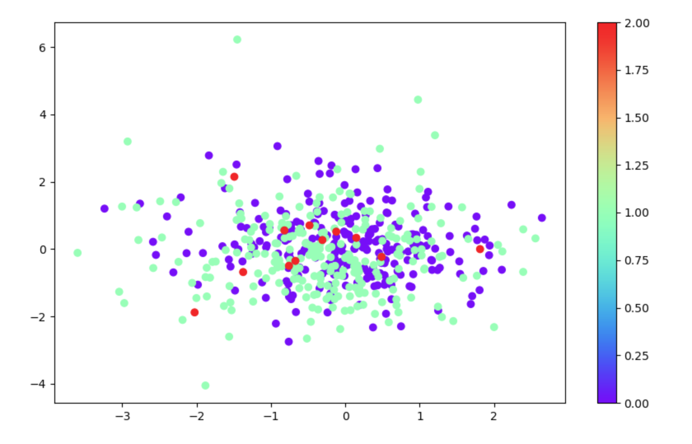


#### **20 training epochs:**

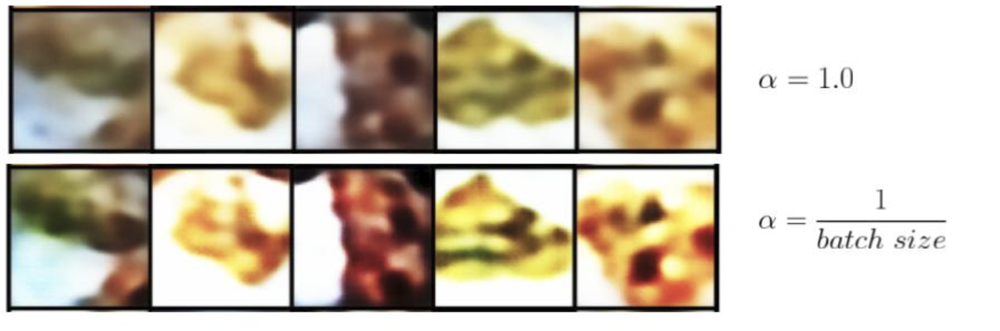

Reconstruction from sampled latent representations: 

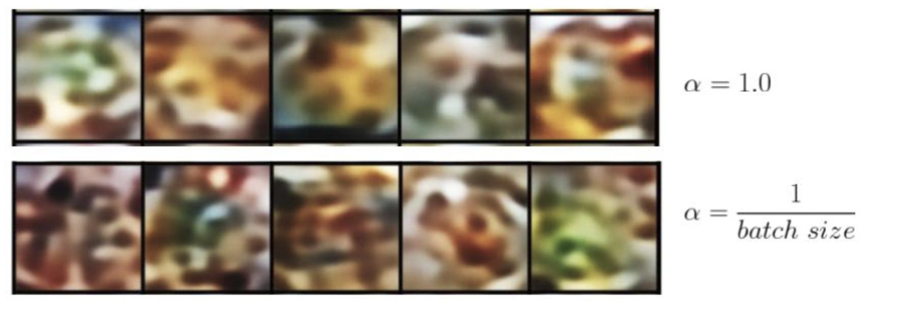

Latent space for the test set (alpha=1):

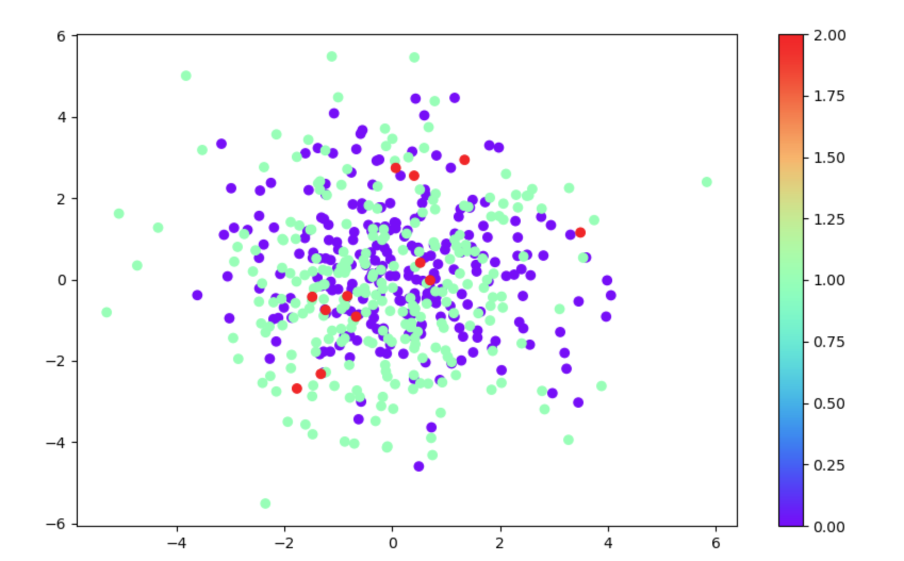

(It seems longer training is required for clusterization in the latent space.) 

Now the generated images (from random latent vector) are more similar to food images. The weighted KL divergence leads to better reconstructions 
but the generated images provide less information. 

## Conclusion

In order to achieve better reconstructions, the latent variables must stay away from each other. Otherwise, 
they may coincide, as a consequence deteriorate the reconstructions. We have to achieve a trade-off between the 
reconstruction error and the VAE penalizer, which pushes the encoder distribution to be similar to the prior latent distribution. 

The VAE reconstructions are quite noisy. The reason is the lower dimension of the latent space comparing to the input images. 
Another reason is the sampling in the latent space. As a result, the VAE penalizer pushes its reconstruction to the mean values of the latent representation
instead of the real values. 


## References:
```
1. @misc{lin2015microsoft,
      title={Microsoft COCO: Common Objects in Context}, 
      author={Tsung-Yi Lin and Michael Maire and Serge Belongie and Lubomir Bourdev and Ross Girshick and James Hays and Pietro Perona and Deva Ramanan and C. Lawrence Zitnick and Piotr Dollár},
      year={2015},
      eprint={1405.0312},
      archivePrefix={arXiv},
      primaryClass={cs.CV}
}
```
```
2. @inproceedings{lee2017cleannet,
  title={CleanNet: Transfer Learning for Scalable Image Classifier Training with Label Noise},
  author={Lee, Kuang-Huei and He, Xiaodong and Zhang, Lei and Yang, Linjun},
  booktitle={Proceedings of the IEEE Conference on Computer Vision and Pattern Recognition ({CVPR})},
  year={2018}
}
```
```
3. @misc{kingma2014autoencoding,
      title={Auto-Encoding Variational Bayes}, 
      author={Diederik P Kingma and Max Welling},
      year={2014},
      eprint={1312.6114},
      archivePrefix={arXiv},
      primaryClass={stat.ML}
}
```
4. GitHub repository: https://github.com/lucabergamini/VAEGAN-PYTORCH