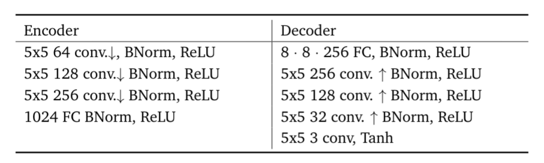
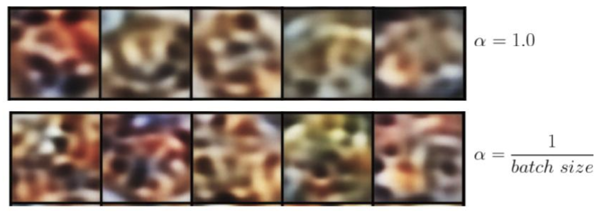

# image-autoencoding

In this task we consider Variational Autoencoder (VAE) in order to reconstruct and generate images for two datasets:
* [MS COCO](https://cocodataset.org/#download)
* [Food-101](https://www.kaggle.com/dansbecker/food-101)

## Project structure

* **configs:** all config files
* **data:** data loader
* **models:** vae architecture: encoder + decoder + re-parametrization layer

## Configs

* ```data_config.py:```   paths to datasets
* ```models_config.py:``` parameters for models
* ```train_config.py:```  training parameters

## Data setup

Specify data directories in ```configs/data_config.py```

Data should have the same data root: 
```python
# root where datasets are located (might be home directory)
data_root = 'datasets/'
```

### MS COCO

* [Training set](http://images.cocodataset.org/zips/train2017.zip) 

* [Testing set](http://images.cocodataset.org/zips/test2015.zip) 

* [Validation set](http://images.cocodataset.org/zips/test2014.zip)

Example directory: ```datasets/coco/[training_set]```

```python
# COCO dataset
dataset = 'coco'
coco_train_data = 'coco_train2017/train2017'
coco_valid_data = 'coco_valid2017/val2017'
coco_test_data = 'coco_test2017/test2017'
```

We use training and testing data for training. We allow to do this since VAE is trained in unsupervised manner. Evaluation is done with validation set.

### Food-101

* [Food-101](https://www.kaggle.com/dansbecker/food-101/download)

Example directory: ```datasets/food-101/[images]```

```python
# FOOD-101 dataset
dataset = 'food-101'
images_data = 'images'
meta_data = 'meta'
```


## Training

1. Set python path
```
export PYTHONPATH=$PYTHONPATH:[absolute path to the folder]/image-autoencoding/
```
2. Specify training parameters in ```train_config.py```, e.g.

  ```python
  batch_size = 512
  learning_rate = 0.001
  weight_decay = 1e-7
  n_epochs = 100
  ```

2. Start training ```vae_train.py```

```
python3 vae_train.py  -o [user path] -l [path to logs]
```
  Flags:
  * ``` -o [user_path]``` user path to save the results
  * ``` -l [path to logs]``` path to save logs
   
## Solution description

* VAE is a widely used generative model, which is used in image reconstruction and generation tasks.
  It provides more efficient way (e.g. in comparison too PCA) to solve the dimensionality reduction problem for high dimensional data (e.g. text, images).
  General VAE architecture is illustrated in Figure:
  


* A disadvantage of a simple autoencoder that its latent space is discrete.
  As a result, there are some points which the autoencoder can not reconstruct. VAE provides continuous latent space 
  due to KL divergence which matches a prior distribution and a predicted encoder distribution.

* We use VAE with the  following decoder and encoder: 
    
   

* Image preprocessing is done in dataloader:
    - Image size = 64;
    - Center crop = 375;
    - Random Horizontal Flip;
    - Transform grey scale images to RGB image by channel replication;
    - Normalization (standardization) with mean=[0.5,0.5,0.5] and std=[0.5,0.5,0.5];
    
* Latent dimension = 128
* Batch size = 64 (512 for latent space visualization)
  
### Loss function

- VAE loss function represents the sum of the reconstruction error and KL divergence.

- Since we use separate optimizers for the encoder and the decoder networks we calculate the following loss function:

```python
if args.mode == 'vae':
        loss_encoder = (1 / batch_size) * torch.sum(kld) + torch.sum(recon_mse)
        # loss_encoder = torch.sum(kld) + torch.sum(recon_mse)
        loss_decoder = torch.sum(args.lambda_mse * recon_mse)
```
- We found that the use of the hyperparameter *lambda_mse* gives better reconstructions.
- We use KL-divergence weighted with batch_size or not (in order to achieve a trade-off between two terms).

### Metrics

There is a huge issue regarding evaluation of generative models. We have just evaluated the reconstructed images with 
the common image similarity metrics:

* Pearson corelation Coefficient (PCC)
* Structural Similarity (SSIM)

However they are not capable to capture human perception.

## Results 

### MS COCO

#### Ground truth images


#### **3 training epochs:**


Reconstruction from sampled latent representations: 


#### **20 training epochs:**


Reconstruction from sampled latent representations: 


Since we use natural scenes which are the most difficult for unsupervised training the images generated from the latent space 
are less meaningful in comparison to the models, which are trained with other more structural and uniform datasets, 
e.g. widely used in related works CelebA dataset with faces, LSUN bedrooms etc. 


### FOOD-101

Let's try tu use more uniform but smaller dataset FOOD-101. We also apply weight for KL divergence term.

#### Ground truth images


#### **3 training epochs:**


Reconstruction from sampled latent representations: 



Latent space for the test set (alpha=1):


#### **10 training epochs:**


Reconstruction from sampled latent representations: 


Latent space for the test set (alpha=1):


#### **20 training epochs:**


Reconstruction from sampled latent representations: 


Latent space for the test set (alpha=1):


(It seems longer training is required for clusterization in the latent space.) 

Now the generated images (from random latent vector) are more similar to food images. Weighted KL divergence leads to better reconstructions 
but the generated images  provide less information. 

## Conclusion

In order to achieve better reconstructions the latent variables must stay away from each other. Otherwise, 
they can coincide, as a consequence deteriorate the reconstructions. Therefore, we have to achieve trade-off between the 
reconstruction error and VAE penalizer, which pushes the encoder distribution to be similar to the prior latent distribution. 

The VAE reconstructions are quite noisy. The reason is the lower dimension of the latent space comparing to the input images. 
Another reason is the sampling in the latent space. As a result, VAE penalizer pushes its reconstruction to the mean values of the latent representation
instead of the real values. 
